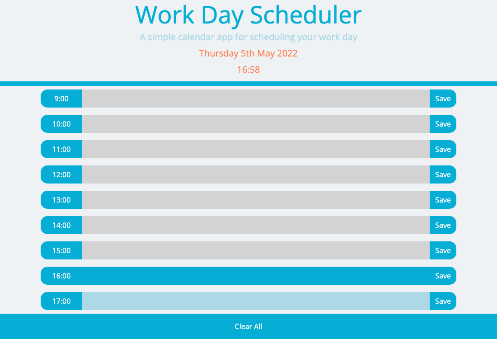
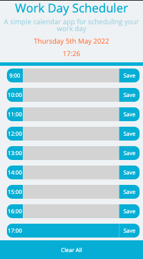

# work_day_planner

A simple calendar application that allows a user to save events for each hour of the day. The app runs in the browser and features dynamically updated HTML and CSS powered by jQuery.

[Deployed GitHub URL]()

## Technologies

- HTML
- CSS
- JavaScript
  - Objects
  - Loops
  - Conditional Statements
- Web APIs
  - Local Storage
- Third Party APIs
  - jQuery
    - Event Listeners
    - Template Strings
    - Document Loading
    - Attributes
    - Targeting
  - Bootstrap
  - Moment.js
- GitHub Pages

## Screenshots

<details>
<summary>Desktop viewport</summary>



</details>

<details>
<summary>Mobile viewport</summary>



</details>
</br>

## User Story

```md
AS AN employee with a busy schedule
I WANT to add important events to a daily planner
SO THAT I can manage my time effectively
```

## Acceptance Criteria

```md
GIVEN I am using a daily planner to create a schedule
WHEN I open the planner
THEN the current day is displayed at the top of the calendar
WHEN I scroll down
THEN I am presented with timeblocks for standard business hours
WHEN I view the timeblocks for that day
THEN each timeblock is color coded to indicate whether it is in the past, present, or future
WHEN I click into a timeblock
THEN I can enter an event
WHEN I click the save button for that timeblock
THEN the text for that event is saved in local storage
WHEN I refresh the page
THEN the saved events persist
```
